# Natural Language Processing

## Lexical Processing

### Introduction

Welcome to the first module of natural language processing. Natural language processing, also referred to as text analytics, plays a very vital role in today’s era because of the sheer volume of text data that users generate around the world on digital channels such as social media apps, e-commerce websites, blog posts, etc. The first session of this module will take you through the following topics:

* Industry applications of text analytics
* Understanding textual data
* Regular expressions

Please note that the terms ‘natural language processing’ and ‘text analytics’ will be used interchangeably in this content. However, they refer to the same entity.

### NLP: Areas of Application
Before diving into what is textual data and how to handle it, let’s take a look at the different industries that make use of text data to solve important problems.

So those were the different areas where text analytics is used extensively.

### Understanding Text
As you learnt in the previous section, NLP has a pretty wide array of applications - it finds use in many fields such as social media, banking, insurance and many more.

However, there is one question that still remains. The data you’ll get while performing analytics on text, very often, will be just a sequence of words. Something like the text shown in the image below:

Now, think about it, if the data you get is of this form, and your task is to create an algorithm that translates this paragraph to a different language, say, Hindi, then how exactly will you do it?

To do so, your system should be able to take the raw unprocessed data shown above, break the analysis down into smaller sequential problems (a pipeline), and solve each of those problems individually. The individual problems could be as simple as breaking the data into sentences, words etc. to something as complex as understanding what a word means, based on the words in its “neighbourhood”.

In this course on ‘Text Analytics’, you’ll learn about all the different “steps” generally undertaken on the journey from data to meaning. This journey can be divided roughly into three parts, which correspond to the three modules that you’ll study one-by-one in this course.

Now that you have looked at the areas of text analytics, let’s take a look at what does it mean to understand the text, i.e., how to approach a problem that deals with text.

Let’s go back to the wikipedia example. Recall what the data (textual data) looked like - it was simply a collection of characters, that machines can’t make any sense  of. Starting with this data, you will move according to the following steps -

* **Lexical Processing**: First, you will just convert the raw text into words and, depending on your application's needs, into sentences or paragraphs as well.

    1. For example, if an email contains words such as lottery, prize and luck, then the email is represented by these words, and it is likely to be a spam email.

    2. Hence, in general, the group of words contained in a sentence gives us a pretty good idea of what that sentence means. Many more processing steps are usually undertaken in order to make this group more representative of the sentence, for example, cat and cats are considered to be the same word. In general, we can consider all plural words to be equivalent to the singular form.

    3. For a simple application like spam detection, lexical processing works just fine, but it is usually not enough in more complex applications, like, say, machine translation. For example, the sentences “My cat ate its third meal” and “My third cat ate its meal”, have very different meanings. However, lexical processing will treat the two sentences as equal, as the “group of words” in both sentences is the same. Hence, we clearly need a more advanced system of analysis.

* **Syntactic Processing**: So, the next step after lexical analysis is where we try to extract more meaning from the sentence, by using its syntax this time. Instead of only looking at the words, we look at the syntactic structures, i.e., the grammar of the language to understand what the meaning is.

    1. One example is differentiating between the subject and the object of the sentence, i.e., identifying who is performing the action and who is the person affected by it. For example, “Ram thanked Shyam” and “Shyam thanked Ram” are sentences with different meanings from each other because in the first instance, the action of ‘thanking’ is done by Ram and affects Shyam, whereas, in the other one, it is done by Shyam and affects Ram. Hence, a syntactic analysis that is based on a sentence’s subjects and objects, will be able to make this distinction.

    2. There are various other ways in which these syntactic analyses can help us enhance our understanding. For example, a question answering system that is asked the question “Who is the Prime Minister of India?”, will perform much better, if it can understand that the words “Prime Minister” are related to “India”. It can then look up in its database, and provide the answer.

    

* **Semantic Processing**: Lexical and syntactic processing don't suffice when it comes to building advanced NLP applications such as language translation, chatbots etc.. The machine, after the two steps given above, will still be incapable of actually understanding the meaning of the text. Such an incapability can be a problem for, say, a question answering system, as it may be unable to understand that PM and Prime Minister mean the same thing. Hence, when somebody asks it the question, “Who is the PM of India?”, it may not even be able to give an answer unless it has a separate database for PMs, as it won’t understand that the words PM and Prime Minister are the same. You could store the answer separately for both the variants of the meaning (PM and Prime Minister), but how many of these meanings are you going to store manually? At some point, your machine should be able to identify synonyms, antonyms, etc. on its own.

    1. This is typically done by inferring the word’s meaning to the collection of words that usually occur around it. So, if the words, PM and Prime Minister occur very frequently around similar words, then you can assume that the meanings of the two words are similar as well.

    2. In fact, this way, the machine should also be able to understand other semantic relations. For example, it should be able to understand that the words “King” and “Queen” are related to each other and that the word “Queen” is simply the female version of the word “King”. Also, both of these words can be clubbed under the word “Monarch”. You can probably save these relations manually, but it will help you a lot more, if you can train your machine to look for the relations on its own, and learn them. Exactly how that training can be done, is something we’ll explore in the third module.

Once you have the meaning of the words, obtained via semantic analysis, you can use it for a variety of applications. Machine translation, chatbots and many other applications require a complete understanding of the text, right from the lexical level to the understanding of syntax to that of meaning. Hence, in most of these applications, lexical and semantic processing simply form the “pre-processing” layer of the overall process. In some simpler applications, only lexical processing is also enough as the pre-processing part.

### Text Encoding
Data is being collected in many languages. However, in this course, you will be doing text analysis for the English language. The text analytics techniques that work for English might not work for other languages.

Let’s see how characters of different languages are stored on computers.

Now, it is not necessary that when you work with text, you’ll get to work with the English language. With so many languages in the world and internet being accessed by many countries, there is a lot of text in non-English languages. For you to work with non-English text, you need to understand how all the other characters are stored.

Computers could handle numbers directly and store them on registers (the smallest unit of memory on a computer). But they couldn’t store the non-numeric characters as is. The alphabets and special characters were to be converted to a numeric value first before they could be stored.

Hence, the concept of **encoding** came into existence. All the non-numeric characters were encoded to a number using a code. Also, the encoding techniques had to be standardised so that different computer manufacturers won’t use different encoding techniques.

The first encoding standard that came into existence was the **ASCII (American Standard Code for Information Interchange) standard**, in 1960. ASCII standard assigned a unique code to each character of the keyboard which was known as  **ASCII code**. For example, the ASCII code of the alphabet ‘A’ is 65 and that of the digit zero is 48. Since then, there have been several revisions made to the codes to incorporate new characters that came into existence after the initial encoding.

When ASCII was built, English alphabets were the only alphabets that were present on the keyboard. With time, new languages began to show up on keyboard sets which brought new characters. ASCII became outdated and couldn’t incorporate so many languages. A new standard has come into existence in recent years - the **Unicode standard**. It supports all the languages in the world - both modern and the older ones.

For someone working on text processing, knowing how to handle encodings becomes crucial. Before even beginning with any text processing, you need to know what kind of encoding the text has and if required, modify it to another encoding format.

In this segment, you’ll understand how encoding works in Python and the different types of encodings that you can use in Python.

To get a more in-depth understanding of Unicode, there’s a guide on official Python website. You can check it out here (https://docs.python.org/3/howto/unicode.html).

To summarise, there are two most popular encoding standards:
1. American Standard Code for Information Interchange (ASCII)
2. Unicode
    * UTF-8
    * UTF-16

Let’s look at the relation between ASCII, UTF-8 and UTF-16 through an example. The table below shows the ASCII, UTF-8 and UTF-16 codes for two symbols - the dollar sign and the Indian rupee symbol.

As you can see, UTF-8 offers a big advantage in cases when the character is an English character or a character from the ASCII character set. Also, while UTF-8 uses only 8 bits to store the character, UTF-16 (BE) uses 16 bits to store it, which looks like a waste of memory.

However, in the second case, a symbol is used which doesn’t appear in the ASCII character set. For this case, UTF-8 uses 24 bits, whereas UTF-16 (BE) only uses 16. Hence the storage advantages offered by UTF-8 is reversed and actually becomes a disadvantage here. Also, the advantage UTF-8 offered previously by being same as the ASCII code is also not of use here, as ASCII code doesn’t even exist for this case.

The default encoding for strings in python is Unicode UTF-8. You can also look at this UTF-8 encoder-decoder to look how a string is stored. Note that, the online tool gives you the hexadecimal codes of a given string.

Try this code in your Jupyter notebook and look at its output. Feel free to tinker with the code. 

[Encoding in Python](dataset/Encoding.ipynb)

In the next segment, we learn about **regular expressions** which are a must-know tool for anyone working in the field of natural language processing and text analytics.

### Regular expressions: Quantifiers - I
This section onwards, you’ll learn about **regular expressions**. Regular expressions, also called **regex**, are very powerful programming tools that are used for a variety of purposes such as feature extraction from text, string replacement and other string manipulations. For someone to become a master at text analytics, being proficient with regular expressions is a must-have skill.

A regular expression is a set of characters, or a **pattern**, which is used to find substrings in a given string. 

Let’s say you want to extract all the hashtags from a tweet. A hashtag has a fixed pattern to it, i.e. a pound (‘#’) character followed by a string. Some example hashtags are - #mumbai, #bangalore, #upgrad. You could easily achieve this task by providing this pattern and the tweet that you want to extract the pattern from (in this case, the pattern is - any string starting with #). Another example is to extract all the phone numbers from a large piece of textual data.

In short, if there’s a pattern in any string, you can easily extract, substitute and do all kinds of other string manipulation operations using regular expressions.

Learning regular expressions basically means learning how to identify and define these patterns.

Regulars expressions are a language in itself since they have their own compilers. Almost all popular programming languages support working with regexes and so does Python.

Let's take a look at how to work with regular expressions in Python. Download the Jupyter notebook provided below to follow along:

[Regular Expression](dataset/Regular_Expressions.ipynb)

In the practice questions that you’ll attempt in this module, the phrases ‘match string’ and ‘extract string’ will be used interchangeably. In both cases, you need to use the 're.search()' function which detects whether the given regular expression pattern is present in the given input string. The 're.search()' method returns a RegexObject (https://docs.python.org/2/library/re.html#re.RegexObject) if the pattern is found in the string, else it returns a None object.

Now, the first thing that you’ll learn about regular expressions is the use of **quantifiers**. Quantifiers allow you to mention and have control over how many times you want the character(s) in your pattern to occur.

Let’s take an example. Suppose you have some data which have the word ‘awesome’ in it. The list might look like - [‘awesome’, ‘awesomeeee’, ‘awesomee’]. You decide to extract only those elements which have more than one ‘e’ at the end of the word ‘awesome’. This is where quantifiers come into picture. They let you handle these tasks.

You’ll learn four types of quantifiers:
1. The ‘?’ operator
2. The ‘*’ operator
3. The ‘+’ operator
4. The ‘{m, n}’ operator

The first quantifier is ‘?’. Let’s understand what the ‘?’ quantifier does.

The ‘?’  can be used where you want the preceding character of your pattern to be an optional character in the string. For example, if you want to write a regex that matches both ‘car’ and ‘cars’, the corresponding regex will be ’cars?’. ‘S’ followed by ‘?’ means that ‘s’ can be absent or present, i.e. it can be present zero or one time.

A ‘*’ quantifier matches the preceding character **any number of times**. Practice some questions below to strengthen your understanding of it.

### Regular Expressions: Quantifiers - II
In the last section, you learnt how to match strings with the ‘?’ and the ‘*’ quantifiers:
* The ‘?’ matches the preceding character zero or one time. It is generally used to mark the **optional presence** of a character.
* The ‘*’ quantifier is used to mark the presence of the preceding character **zero or more times**.

Now, you’ll learn about a new quantifier - the '+'.

The ‘+’ quantifier matches the preceding character **one or more times**. That means the preceding character has to be present **at least once** for the pattern to match the string.

Thus, the only difference between '+' and '*' is that the '+' needs a character to be present **at least once**, while the '*' does not.

To summarise, you have learnt the following quantifiers until now :
* '?': Optional preceding character
* '*': Match preceding character zero or more times
* '+': Match preceding character one or more times (i.e. at least once)

But how do you specify a regex when you want to look for a character that appears, say, exactly 5 times, or between 3-5 times? You cannot do that using the quantifiers above.

Hence, the next quantifier that you’ll learn will help you specify occurrences of the preceding character a **fixed number of times**.

There are four variants of the quantifier {m,n}:
1. {m, n}: Matches the preceding character ‘m’ times to ‘n’ times.
2. {m, }: Matches the preceding character ‘m’ times to infinite times, i.e. there is no upper limit to the occurrence of the preceding character.
3. {, n}: Matches the preceding character from zero to ‘n’ times, i.e. the upper limit is fixed regarding the occurrence of the preceding character.
4. {n}: Matches if the preceding character occurs exactly ‘n’ number of times.

Note that while specifying the {m,n} notation, avoid using a space after the comma, i.e. use {m,n} rather than {m, n}.

An interesting thing to note is that this quantifier can replace the ‘?’, ‘*’ and the ‘+’ quantifier. That is because:
* '?' is equivalent to zero or once, or {0, 1}
* '*' is equivalent to zero or more times, or {0, }
* '+' is equivalent to one or more times, or {1, }

### Comprehension: Regular Expressions
In this section, you’ll learn some new concepts of regular expressions. 

The first is the use of **whitespace**. Till now, in the regular expression pattern, you didn’t use a whitespace character. A whitespace comprises of a single space, multiple spaces, tab space or a newline character (also known as a vertical space). You can learn about multiple spaces in a computer here (https://en.wikipedia.org/wiki/Whitespace_character). Turns out, you can use these spaces in your regular expression normally.
 
These whitespaces will match the corresponding spaces in the string. For example, the pattern ‘ +’, i.e. a space followed by a plus sign will match one or more spaces. Similarly, you could use spaces with other characters inside the pattern. The pattern, ‘James Allen’ will allow you to look for the name ‘James Allen’ in any given string.

When you learn about character classes later in this session, you’ll see the different types of spaces that one can use. Whitespaces are used extensively when used inside character sets about which we will see later.

Moving onto the next notation - the **parentheses**. Till now, you have used quantifiers preceded by a single character which meant that the character preceded by the quantifier can repeat a specified number of times. If you put the parentheses around some characters, the quantifier will look for repetition of the **group of characters** rather than just looking for repetitions of the preceding character. This concept is called **grouping** in regular expression jargon. For example, the pattern ‘(abc){1, 3}’ will match the following strings:
* abc
* abcabc
* abcabcabc

Similarly, the pattern (010)+ will match:
* 010
* 010010
* 010010010, and so on.

Let’s move to the next notation - the **pipe operator**. It’s notated by ‘|’. The pipe operator is used as an OR operator. You need to use it inside the parentheses. For example, the pattern ‘(d|g)one’ will match both the strings - ‘done’ and ‘gone’. The pipe operator tells that the place inside the parentheses can be either ‘d’ or ‘g’.

Similarly, the pattern ‘(ICICI|HDFC) Bank’ will match the strings ‘ICICI Bank’ and ‘HDFC Bank’. You can also use quantifiers after the parentheses as usual even when there is a pipe operator inside. Not only that, there can be an infinite number of pipe operators inside the parentheses. The pattern ‘(0|1|2){2} means 'exactly two occurrences of either of 0, 1 or 2', and it will match these strings - ‘00’, ‘01’, ‘02’, ‘10’, ‘11’, ‘12’, ‘20’, ‘21’ and ‘22’.

Lastly, you will often find yourself in situations where you will need to mention characters such as ‘?’, ‘*’, ‘+’, ‘(‘, ‘)’, ‘{‘, etc. in your regular expressions. These are called **special characters** since they have special meanings when they appear inside a  regex pattern (as you have already seen).

Suppose you want to extract all the questions from a document, and you assume that all questions end with a question mark - ‘?’. So you would need to use the ‘?’ in the regular expression. Now, you already know that ‘?’ has a special meaning in regular expressions. So, how do you tell regular expression engine that you want to match the question mark literally in the sentence, rather than as a special character (which it is by default)? 

In situations such as these, you’ll need to use **escape sequences**. The escape sequence, denoted by a backslash ‘\’, is used to escape the special meaning of the special characters. To match a question mark literally, you need to use '\?' (this is called escaping the character).

Let's take another example - if you want to match the addition symbol in a string, you can’t use the pattern ‘+’. You need to escape the ‘+’ operator and the pattern that you’re going to use in this case is ‘\+’. 

Now, let’s say we have this string - ‘Dravid, who scored 56(78), was bowled by Brett Lee after lunchtime’. Suppose, we want to extract ‘(78)’ from the given string. To do that, we can’t use the pattern ‘(78)’. If we use it, we’ll get ‘78’ instead of ‘(78)’. What we really want is the substring ‘(78)’. Therefore, we need to escape the special meaning of the parentheses in this case. The pattern that we’re going to use is ‘\(78\)’. The special character is preceded by the escape character that you want to escape.

**Note**: The '\' itself is a special character, and to match the ‘\’ character literally, you need to escape it too. You can use the pattern ‘\\’ to escape the backslash.

Now, there are something called as regex flags. A flag has a special meaning. For example, if you want your regex to ignore the case of the text then you can pass the 're.I' flag. Similarly, you have can have a flag with the syntax re.M that enables you to search in multiple lines (in case the input text has multiple lines). You can pass all these flags in the re.search() function. The syntax to pass multiple flags is:

Last, you need to know about the re.compile() function. This function stores the regular expression pattern in the cache memory and is said to result in a little faster searches. You need to pass the regex pattern to re.compile() function. The following piece of code shows the difference between searching with the compile function and without the compile function.

So that was all on quantifiers. In the next section, you’ll learn about anchors.

### Regular Expressions: Anchors and Wildcard
Next, you will learn about anchors in regular expressions. Anchors are used to specify the start and end of the string.

The two anchors characters: ‘^’ and ‘$’.

The ‘^’ specifies the start of the string. The character followed by the ‘^’ in the pattern should be the first character of the string in order for a string to match the pattern.

Similarly, the ‘$’ specifies the end of the string. The character that precedes the ‘$’ in the pattern should be the last character in the string in order for the string to match the pattern.

Both the anchors can be specified in a single regular expression itself. For example, the regular expression pattern ‘^01*0$’ will match any string that starts and end with zeroes with any number of 1s between them. It will match ‘010’, ‘0110’, ‘01111111110’ and even ‘00’ (‘*’ matches zero or more 1s). But it will not match the string ‘0’ because there is only one zero in this string and in the pattern we have specified that there needs to be two 0s, one at the start and one at the end.

Now, there is one special character in regular expressions that acts as a placeholder and can match any character (literally!) in the given input string. It’s the ‘.’ (dot) character is also called the **wildcard character**.

Till now, you were mentioning the exact character followed by a quantifier in your regular expression patterns. For example, the pattern ‘hur{2,}ay’ matches ‘hurray’, ‘hurrray’, ‘hurrrray’ and so on. Here, we had specified that the letter ‘r’ should be present two or more times. But you don’t always know the letter that you want to repeat. In such situations, you’ll need to use the wildcard instead. 

The wildcard comes handy in many situations. It can be followed by a quantifier which specifies that any character is present a specified number of times.

For example, if you’re asked to write a regex pattern that should match a string that starts with four characters, followed by three 0s and two 1s, followed by any two characters. The valid strings can be abcd00011ft, jkds00011hf, etc. The pattern that satisfies this kind of condition would be ‘.{4}0{3}1{2}.{2}’. You can also use ‘....00011..’ where the dot acts as a placeholder which means anything can sit on the place of the dot. Both are correct regex patterns.

So, you learnt how the ‘.’ character can act as a placeholder for any character and how to use it. 

### Regular Expressions: Characters Sets
Until now, you were either using the actual letters (such as ab, 23, 78, etc.) or the wildcard character in your regular expression patterns. There was no way of telling that the preceding character is a digit, or an alphabet, or a special character, or a combination of these.

For example, say you want to match phone numbers in a large document. You know that the numbers may contain hyphens, plus symbol etc. (e.g. +91-9930839123) , but it will not have any alphabet. You need to somehow specify that you are looking only for numerics and some other symbols, but avoid alphabets.

To handle such situations, you can use what are called **character sets** in regular expression jargon.

The following segment explains the various types of characters sets available in regular expressions, and how can you use them in different situations.

Character sets provide lot more flexibility than just typing a wildcard or the literal characters. Character sets can be specified with or without a quantifier. When no quantifier succeeds the character set, it matches only one character and the match is successful only if the character in the string is one of the characters present inside the character set. For example, the pattern ‘[a-z]ed’ will match strings such as ‘ted’, ‘bed’, ‘red’ and so on because the first character of each string - ‘t’, ‘b’ and ‘r’ - is present inside the range of the character set.

On the other hand, when we use a character set with a quantifier, such as in this case - ‘[a-z]+ed’, it will match any word that ends with ‘ed’ such as ‘watched’, ‘baked’, ‘jammed’, ‘educated’ and so on. In this way, a character set is similar to a wildcard because it can also be used with or without a quantifier. It’s just that a character set gives you more power and flexibility!

Note that **a quantifier loses its special meaning** when it’s present inside the character set. Inside square brackets, it is treated as any other character. 

You can also mention a whitespace character inside a character set to specify one or more whitespaces inside the string. The pattern [A-z ] can be used to match the full name of a person. It includes a space, so it can match the full name which includes the first name, a space, and the last name of the person.

But what if you want to match every other character other than the one mentioned inside the character set. You can use the caret operator to do this.

The ‘^’ has two use cases. You already know that it can be used outside a character set to specify the start of a string. Here, it is known as an **anchor**.

It’s another use is inside a character set. When used inside a character set, it acts as a **complement operator**, i.e. it specifies that it will match any character other than the ones mentioned inside the character set.

The pattern [0-9] matches any single digit number. On the other hand, the pattern ‘[^0-9]’ matches any single digit character that is not a digit.

### Meta Sequences
When you work with regular expressions, you’ll find yourself using characters often. You’ll commonly use sets to match only digits, only alphabets, only alphanumeric characters, only whitespaces, etc.

Therefore, there is a shorthand way to write commonly used character sets in regular expressions. These are called meta-sequences.

Those were the commonly used meta-sequences. You can use meta-sequences in two ways:
1. You can either use them without the square brackets. For example, the pattern ‘\w+’ will match any alphanumeric character.
2. Or you can them it inside the square brackets. For example, the pattern ‘[\w]+’ is same as ‘\w+’. But when you use meta-sequences inside a square bracket, they’re commonly used along with other meta-sequences. For example, the ‘[\w\s]+’ matches both alphanumeric characters and whitespaces. The square brackets are used to group these two meta-sequences into one.
 
### Greedy versus Non-greedy Search
When you use a regular expression to match a string, the regex greedily tries to look for the longest pattern possible in the string. For example, when you specify the pattern 'ab{2,5}' to match the string 'abbbbb', it will look for the maximum number of occurrences of 'b' (in this case 5).

This is called a 'greedy approach'. By default, a regular expression is greedy in nature.

There is another approach called the non-greedy approach, also called the lazy approach, where the regex stops looking for the pattern once a particular condition is satisfied.

Let’s look in detail when and how to use the non-greedy technique.

Let’s understand the non-greedy or the lazy approach with an example. Suppose, you have the string ‘3000’. Now, if you use the regular expression ‘30+’, it means that you want to look for a string which starts with ‘3’ and then has one or more '0's followed by it. This pattern will match the entire string, i.e. ‘3000’. This is the greedy way. But if you use the non-greedy technique, it will only match ‘30’ because it still satisfies the pattern ‘30+’ but stops as soon as it matches the given pattern.

It is important to not confuse the greedy approach with matching multiple strings in a large piece of text - these are different use cases. Similarly,  the lazy approach is different from matching only the first match.

For example, take the string ‘One batsman among many batsmen.’. If you run the patterns ‘bat*’ and ‘bat*?’ on this text, the pattern ‘bat*’ will match the substring ‘bat’ in ‘batsman’ and ‘bat’ in ‘batsmen’ while the pattern ‘bat*?’ will match the substring ‘ba’ in batsman and ‘ba’ in ‘batsmen’. The pattern ‘bat*’ means look for the term ‘ba’ followed by zero or more ‘t’s so it greedily looks for as many ‘t’s as possible and the search ends at the substring ‘bat’. On the other hand, the pattern ‘bat*?’ will look for as few ‘t’s as possible. Since ‘*’ indicates zero or more, the lazy approach stops the search at ‘ba’.

To use a pattern in a non-greedy way, you can just put a question mark at the end of any of the following quantifiers that you’ve studied till now:
* *
* +
* ?
* {m, n}
* {m,}
* {, n}
* {n}

The lazy quantifiers of the above greedy quantifiers are:
* *?
* +?
* ??
* {m, n}?
* {m,}?
* {, n}?
* {n}?

### Commonly Used RE Functions
Till now you’ve seen only one function of the 're' module, that is, the 're.search()' function. While it is a very common function used while working with regular expressions in python, it is not the only function that you’d use while working with regular expressions.

You’re going to learn about four more functions in this section one-by-one. Let’s look at the other functions.

The match function will only match if the pattern is present at the very start of the string. On the other hand, the search function will look for the pattern starting from the left of the string and keeps searching until it sees the pattern and then returns the match.

The next function that you’re going to study is the **re.sub()** function. It is used to substitute a substring with another substring of your choice. 

Regular expression patterns can help you find the substring in a given corpus of text that you want to substitute with another string. For example, you might want to replace the American spelling ‘color’ with the British spelling ‘colour’. Similarly, the re.sub() function is very useful in text cleaning. It can be used to replace all the special characters in a given string with a flag string, say, SPCL_CHR, just to represent all the special characters in the text.

The re.sub() function is used to substitute a part of your string using a regex pattern. It is often the case when you want to replace a substring of your string where the substring has a particular pattern that can be matched by the regex engine and then it is replaced by the re.sub() command. 

Note that, this command will replace all the occurrences of the pattern inside the string. For example, take a look at the following command:

It will change the string to: "My address is XXB, Baker Street"

To summarise, the match and search command return only one match. But you often need to extract all the matches rather than only the first match, and that's when you use the other methods.

Suppose, in a huge corpus of text, you want to extract all the dates, in that case you can use the finditer() function or the findall() function to extract the results. The result of the findall() function is a list of all the matches and the finditer() function is used in a 'for' loop to iterate through each separate match one by one.

### Regular Expressions: Grouping
Sometimes you need to **extract sub-patterns out of a larger pattern**. This can be done by using **grouping**. Suppose you have textual data with dates in it and you want to extract only the year from the dates. You can use a regular expression pattern with grouping to match dates and then you can extract the component elements such as the day, month or the year from the date.

Grouping is achieved using the parenthesis operators. Let’s understand grouping using an example.

Let’s say the source string is: “Kartik’s birthday is on 15/03/1995”. To extract the date from this string you can use the pattern - “\d{1,2}\/\d{1,2}\/\d{4}”.

Now to extract the year, you can put parentheses around the year part of the pattern. The pattern is: “^\d{1,2}/\d{1,2}/(\d{4})$”.

Grouping is a very useful technique when you want to extract substrings from an entire match.

### Regular Expressions: Use Cases
Let’s see some examples where regular expressions can be used as a handy tool. These use cases will demonstrate how can you use regular expressions for practical applications.

The following code demonstrates how regex can be used for a file search operation. Say you have a list of folders and filenames called 'items' and you want to extract (or read) only some specific files, say images.

If you run the above code in Python, you’ll get the following result.
* ['image001.jpg', 'image002.jpg', 'image005.jpg', 'wallpaper.jpg', 'flower.jpg', 'earth.jpg', 'monkey.jpg']

The above code extracts only those documents which have ‘.jpg’ extension. The pattern ‘.*\.jpg$’ is pretty self-explanatory. The important thing here is the use of backslash. If you don’t escape the dot operator with a backslash, you won’t get the results you want. Try to run the code without the escape sequence.

Take a look at another example. This is just an extension to the previous example. In this case, we’re trying to extract documents that start with the prefix ‘image’ and end with the extension ‘.jpg’. Here’s the code:

You saw how to search for specific file names using regular expressions. Similarly, they can be used to extract features from text such as the ones listed below:
* Extracting dates
* Extracting emails
* Extracting phone numbers, and other patterns.

Along with the applications in NLP, regular expressions are extensively used by software engineers in various applications such as checking if a new password meets the minimum criteria or not, checking if a new username meets the minimum criteria or not, and so on.

Now, let’s end the session with a practical tip. You’ve already gotten to know that there are websites such as this(https://regex101.com/) one which helps you to compile your regular expression because sometimes it can get very hard to write regular expressions. There are various other online tools as well which provide intuitive interfaces to write and test your regex instantly.

### Regular Expressions - Practice Exercises
Regular expressions happen to be one of those concepts which you'll be able to retain in memory only with frequent practice. There are numerous online tools that teach and let you practice regex, online. Here(https://regexone.com/) is one such tool that you can use to quickly revise all the commnly used regex patterns and concepts.

[Regular Expression Excercises](dataset/BonusExerciseWithSolution.ipynb)

## Basic Lexical Processing

### Introduction
Welcome to the second session of first module. In the last session, you learnt regular expressions and their use cases. That was a very essential skill to learn before applying your hands on any kind of text processing.

In this session you will learn basic lexical processing. You will get to know the various preprocessing steps you need to apply before you can do any kind of text analytics such as apply machine learning on text, building language models, building chatbots, building sentiment analysis systems and so on. These steps are used in almost all applications that work with textual data. We will also build a spam-ham detector system side-by-side on a very unclean corpus of text. Corpus is just a name to refer to textual data in NLP jargon.

Now, you have already built a spam detector while learning about the naive-bayes classifier. Here, you will learn all the preprocessing steps that one needs to do before using a machine learning algorithm on the spam messages dataset. Note that, the preprocessing steps that we teach you here are not limited to building a spam detector. 

Specifically, you will learn:
* How to preprocess text using techniques such as
    * Tokenisation
    * Stop words removal
    * Stemming
    * Lemmatization
* How to build a spam detector using one of the following models:
    * Bag-of-words model
    * TF-IDF model

### Word Frequencies and Stop Words
While working with any kind of data, the first step that you usually do is to explore and understand it better. In order to explore text data, you need to do some basic preprocessing steps. In the next few segments, you will learn some basic preprocessing and exploratory steps applicable to almost all types of textual data.

Now, a text is made of characters, words, sentences and paragraphs. The most basic statistical analysis you can do is to look at the **word frequency distribution**, i.e. visualising the word frequencies of a given text corpus.

It turns out that there is a common pattern you see when you plot word frequencies in a fairly large corpus of text, such as a corpus of news articles, user reviews, Wikipedia articles, etc. Now we will learn what **stopwords** are and why they are lesser relevant than other words.

To summarise, the Zipf's law (discovered by the linguist-statistician George Zipf) states that the frequency of a word is inversely proportional to the rank of the word, where rank 1 is given to the most frequent word, 2 to the second most frequent and so on. This is also called the **power law distribution**.

The Zipf's law helps us form the basic intuition for **stopwords** - these are the words having the highest frequencies (or lowest ranks) in the text, and are typically of limited 'importance'.

Broadly, there are three kinds of words present in any text corpus:
* Highly frequent words, called stop words, such as ‘is’, ‘an’, ‘the’, etc.
* Significant words, which are typically more important to understand the text
* Rarely occurring words, which are again less important than significant words

Generally speaking, stopwords are removed from the text for two reasons:
* They provide no useful information, especially in applications such as spam detector or search engine. Therefore, you’re going to remove stopwords from the spam dataset.
* Since the frequency of words is very high, removing stopwords results in a much smaller data as far as the size of data is concerned. Reduced size results in faster computation on text data. There’s also the advantage of less number of features to deal with if stopwords are removed.

However, there are exceptions when these words should not be removed. In the next module, you’ll learn concepts such as POS (parts of speech) tagging and parsing where stopwords are preserved because they provide meaningful (grammatical) information in those applications. Generally, stopwords are removed unless they prove to be very helpful in your application or analysis.

On the other hand, you’re not going to remove the rarely occurring words because they might provide useful information in spam detection. Also, removing them provides no added efficiency in computation since their frequency is so low.

Now, that we learnt about word frequencies and stopwords, let’s see how to make the frequency chart on your own. Lets see how to make frequency distribution from a text corpus and how to remove stopwords in python using the NLTK library.

[Word Frequencies and Stop Words](dataset/stopwords.ipynb)

We saw how to create word frequency plots and how to remove stop words using the NLTK’s list of stopwords. 

### Tokenisation
You already know that you’re going to build a spam detector by the end of this module. In the spam detector application, you’re going to use word tokenisation, i.e. break the text into different words, so that each word can be used as a feature to detect whether the given message is a spam or not.

Now, let’s take a look at the spam messages dataset to get a better understanding of how to approach the problem of building a spam detector.

Download the spam dataset from the link given below. It is used in the notebook.

[Spam Messages Data](dataset/SMSSpamCollection.txt)

As you saw, there is a lot of noise in the data. Noise is in the form of non-uniform cases, punctuations, spelling errors. These are exactly the things that make it hard for anyone to work on text data.

There is another thing to think about - how to extract features from the messages so that they could be used to build a classifier. When you create any machine learning model such as a spam detector, you will need to feed in features related to each message that the machine learning algorithm can take in and build the model. But here, in the spam dataset, you only have two columns - one column contains the message and the other contains the label related to the message. And as you know, machine learning works on numeric data, not text. Earlier when you worked with text columns, you either treated them as categorical variables and converted each categorical variable to numeric variable by either assigning numeric values to each category, or you created dummy variables. Here, you can do neither of these, since the message column is unique, it’s not a categorical variable. If you treat it as a category, your model will fail miserably. You can try it as an exercise.

To deal with this problem, you will extract features from the messages. From each message you’ll extract each word by breaking each message into separate words or 'tokens'.

This technique is called **tokenisation** - a technique that’s used to split the text into smaller elements. These elements can be characters, words, sentences, or even paragraphs depending on the application you’re working on.

In the spam detector case, you will break each message into different words, so it’s called **word tokenisation**. Similarly, you have other types of tokenisation techniques such as character tokenisation, sentence tokenisation, etc. Different types of tokenisation are needed in different scenarios.

Now, let’s take a look at what exactly tokenisation is and how to do it in NLTK.

[Tokenisation](dataset/tokenisation.ipynb)

There are multiple ways of doing a particular thing in Python. To tokenise words, you can use the split() method that just splits text on white spaces, by default. This method doesn’t always give good results. You are better off using NLTK’s tokeniser which handles various complexities of text. One of them is that it handles **contractions** such as “can’t”, “hasn’t”, “wouldn’t”, and other contraction words and splits these up although there is no space between them. On the other hand, it is smart enough to not split words such as “o’clock” which is not a contraction word.

In NLTK, you also have different types of tokenisers present that you can use in different applications. The most popular tokenisers are:
1. **Word tokeniser** splits text into different words.
2. **Sentence tokeniser** splits text in different sentence.
3. **Tweet tokeniser** handles emojis and hashtags that you see in social media texts
4. **Regex tokeniser** lets you build your own custom tokeniser using regex patterns of your choice.

### Bag-of-Words Representation
You have now learnt two preprocessing steps - tokenisation and removing stopwords. But you still can’t use the list of words that you get after these processing steps to train a machine learning model.

In this section, you’ll learn how to represent text in a format that you can feed into machine learning algorithms. The most common and most popular approach is to create a **bag-of-words representation** of the text data that you have. The central idea is that any given piece of text, i.e., tweets, articles, messages, emails etc., can be “represented” by a list of all the words that occur in it (after removing the stopwords), where the **sequence of occurrence does not matter**. You can visualise it as the “bag” of all “words” that occur in it. For example, consider the messages:

“Gangs of Wasseypur is a great movie”

The bag of words representation for this message would be:

This way, you can create “bags” for representing each of the messages in your training and test data set. But how do you go from these bags to building a spam classifier?

Let’s say the bags, for most of the spam messages, contain words such as prize, lottery etc., and most of the ham bags don’t. Now, whenever you run into a new message, just look at its “bag-of-words” representation. Does the bag for this message resemble that of messages you already know as spam, or does it not resemble them? Based on the answer to the previous question, you can then classify the message.

Now, the next question is, how do you get a machine to do all of that? Well, turns out that for doing that, you need to represent all the bags in a matrix format, after which you can use ML algorithms such as naive Bayes, logistic regression, SVM etc., to do the final classification.

But how is this matrix representation created? Let’s understand it 

So, that’s how text is represented in the form of matrix. It can then be used to train machine learning models. Each document sits on a separate row and each word of the vocabulary has a its own column. These vocabulary words are also called as **features** of the text.

The bag-of-words representation is also called bag-of-words model but this is not to be confused with a machine learning model. A bag-of-words model is just the matrix that you get from text data.

Another thing to note is that the values inside any cell can be filled in two ways - 1) you can either fill the cell with the frequency of a word (i.e. a cell can have a value of 0 or more), or 2) fill the cell with either 0, in case the word is not present or 1, in case the word is present (binary format).

Both approaches work fine and don’t usually result in a big difference. The frequency approach is slightly more popular and the NLTK library in Python also fills the bag-of-words model with word frequencies rather than binary 0 or 1 values.

Now, let’s see how bag-of-words model is built in Python. Download the Jupyter notebook of the code here, to follow along:

[Bag of Words](dataset/bag+of+words.ipynb)

Download the spam messages dataset that is used to create a bag-of-words model:

[Spam Messages Data](dataset/SMSSpamCollection.txt)

To build a bag-of-words model in Python, you can use the scikit-learn library. As you saw, you get lots of redundant features after building the model. There were features such as ‘get’ and ‘getting’, ‘goes’ and ‘going’, ‘see’ and ‘seeing’ and along with a lot of other duplicate features. They are not exactly duplicates but they’re redundant in the sense that they’re not giving you any extra information about the message. In fact, the words ‘winner’ and ‘win’ are equivalent when your goal is to detect whether a message is spam or not.

Hence, keeping the two separate is actually going to hinder the performance of the machine learning algorithm since it is redundant information. Also, this redundancy is going to increase the number of features due to which the classifier can face the curse of dimensionality. To get rid of this problem, you’re going to learn two more preprocessing techniques - **stemming** and **lemmatization** - in the next section.

### Stemming and Lemmatization
In the last section, you had seen the problem of redundant tokens. This will result in an inefficient model when you build your spam detector. Stemming makes sure that different variations of a word, say ‘warm’, warmer’, ‘warming’ and ‘warmed,’ are represented by a single token - ‘warm’, because they all represent the same information (represented by the 'stem' of the word).

Another similar preprocessing step (and an alternative to stemming) is lemmatisation.

You’ll now learn about these two techniques that will help you deal with the problem of redundant tokens:
1. Stemming
2. Lemmatization

If you noticed, the repeated tokens or features were nothing but a variation or an **inflected form** of the other token. For example, the word ‘seeing’ is an inflection of the word ‘see’. Similarly, the word ‘limited’ is an inflection of the word ‘limit’. The two techniques that you just learnt reduce these inflected words to the original base form. But which is one is a better technique in what situations? Let’s look at them one by one:

### Stemming
It is a **rule-based** technique that just chops off the suffix of a word to get its root form, which is called the ‘stem’. For example, if you use a stemmer to stem the words of the string - "The driver is racing in his boss’ car", the words ‘driver’ and ‘racing’ will be converted to their root form by just chopping of the suffixes ‘er’ and ‘ing’. So, ‘driver’ will be converted to ‘driv’ and ‘racing’ will be converted to ‘rac’.

You might think that the root forms (or stems) don’t resemble the root words - ‘drive’ and ‘race’. You don’t have to worry about this because the stemmer will convert all the variants of ‘drive’ and ‘racing’ to those root forms only. So, it will convert ‘drive’, ‘driving’, etc. to ‘driv’, and ‘race’, ‘racer’, etc. to ‘rac’. This gives us satisfactory results in most cases.

There are two popular stemmers:
* **Porter stemmer**: This was developed in 1980 and works only on English words. You can find all the detailed rules of this stemmer here(http://snowball.tartarus.org/algorithms/porter/stemmer.html).
* **Snowball stemmer**: This is a more versatile stemmer that not only works on English words but also on words of other languages such as French, German, Italian, Finnish, Russian, and many more languages. You can learn more about this stemmer here(http://snowball.tartarus.org/).

### Lemmatization

This is a more sophisticated technique (and perhaps more 'intelligent') in the sense that it doesn’t just chop off the suffix of a word. Instead, it takes an input word and searches for its base word by going recursively through all the variations of dictionary words. The base word in this case is called the **lemma**. Words such as ‘feet’, ‘drove’, ‘arose’, ‘bought’, etc. can’t be reduced to their correct base form using a stemmer. But a lemmatizer can reduce them to their correct base form. The most popular lemmatizer is the **WordNet lemmatizer** created by a team od researchers at the Princeton university. You can read more about it here(https://wordnet.princeton.edu/).

Nevertheless, you may sometimes find yourself confused in whether to use a stemmer or a lemmatizer in your application. The following points might help you make the decision:
1. A stemmer is a rule based technique, and hence, it is much faster than the lemmatizer (which searches the dictionary to look for the lemma of a word). On the other hand, a stemmer typically gives less accurate results than a lemmatizer.
2. A lemmatizer is slower because of the dictionary lookup but gives better results than a stemmer. Now, as a side note, it is important to know that for a lemmatizer to perform accurately, you need to provide the **part-of-speech tag** of the input word (noun, verb, adjective etc.). You’ll see learn POS tagging in the next session - but it would suffice to know that there are often cases when the POS tagger itself is quite inaccurate on your text, and that will worsen the performance of the lemmatiser as well. In short, you may want to consider a stemmer rather than a lemmatiser if you notice that POS tagging is inaccurate.

In general, you can try both and see if its worth using a lemmatizer over a stemmer. If a stemmer is giving you almost same results with increased efficiency than choose a stemmer, otherwise use a lemmatizer.

Now, let’s see how to use a stemmer on a text corpus in Python. You can download the notebook:

[Stemming](dataset/stemming.ipynb)

You learnt to use two types of stemmers - the Porter stemmer and the Snowball stemmer. Snowball stemmer works a little better, but usually, you won’t see much of a difference as both of them are rule based. Snowball has some updated rules and that’s why you saw it stems some words differently. 

Next, let’s see how to lemmatize words in Python. You can download the notebook used by the professor here:

**CLARIFICATION**: You observed that in this case, lemmatization was faster than stemming. That’s due to the fact that we didn’t pass the part-of-speech tag with each word. Because of this, lemmatization happened quickly, but incorrectly. Had we passed the POS tag for each word, lemmatization would have had much more accuracy than stemming, but it would have also taken a lot of time.

You’ll see how to find the POS tag of a word in the second module. Then, you’ll be able to pass each word’s POS tag along with it to lemmatize it correctly.

### Final Bag-of-Words Representation
You’ve learn quite a few techniques in lexical preprocessing, namely:
1. Plotting word frequencies and removing stopwords
2. Tokenisation
3. Stemming
4. Lemmatization

Now, let’s create the bag-of-words model, again, but this time, using stemming and lemmatization along with the other preprocessing steps. It will result in reducing the number of features by eliminating redundant features that we had created earlier. But more importantly, will lead to a more efficient representation. You can download the Jupyter notebook:

[Final Bag-of-words representation Notebook](dataset/final+bag+of+words.ipynb)

You saw how stemming and lemmatization performed on the spam dataset. Lemmatization didn’t perform as good as it should have because of two reasons:
1. Lemmatization expected the POS tag of the word to be passed along with the word. We didn’t pass the POS tag here. You’ll learn how to assign POS tags in the next module.
2. Lemmatization only works on correctly spelt words. Since there are a lot of misspelt words in the dataset, lemmatization makes no changes to them.

In other words, the comparison of stemming and lemmatization wasn’t actually fair. You can redo this comparison when you learn to tag each word with it’s POS tag. Then, you can automate the process of lemmatization by passing the word along with it’s POS tag. It will be fair to compare the process of stemming and lemmatization only then. The comparison here was just for demonstration purposes.

### TF-IDF Representation
The bag of words representation, while effective, is a very naive way of representing text. It relies on just the word frequencies of the words of a document. But don’t you think word representation shouldn’t solely rely on the word frequency? There is another way to represent documents in a matrix format which represents a word in a smarter way. It’s called the TF-IDF representation and it is the one that is often preferred by most data scientists.

The term TF stands for term frequency, and the term IDF stands for inverse document frequency. How is this different from bag-of-words representation?

The TF-IDF representation, also called the **TF-IDF model**, takes into the account the importance of each word. In the bag-of-words model, each word is assumed to be equally important, which is of course not correct.

The formula to calculate TF-IDF weight of a term in a document is:

Note that tf-idf is implemented in different ways in different languages and packages. In the **tf score** representation, some people use only the frequency of the term, i.e. they don’t divide the frequency of the term with the total number of terms. In the **idf score** representation, some people use natural log instead of the log with base 10. Due to this, you may see a different score of the same terms in the same set of documents. But the goal remains the same - assign a weight according to the word's importance. 

Now, let’s see how tf-idf is implemented in Python. Download the Jupyter notebook to follow along:

[TF-IDF Representation Notebook](dataset/tf-idf.ipynb)

### Building a Spam Detector - I
You’ve learnt all the basic preprocessing steps required for most text analytics applications. In this section, you will learn how to apply these steps to build a spam detector.

Until now, you had learnt how to use the scikit-learn library to train machine learning algorithms. Here, we will demonstrate how to build a spam detector using NLTK library which is, as you might have already realised, is your go-to tool when you’re working with text.

Now, it is not necessary for you to learn how to use NLTK’s machine learning functions. But it’s always nice to have knowledge of more than one tool. More importantly, we’ll demonstrate how to extract features from the raw text without using the scikit-learn package. So take this demonstration as a bonus as you'll learn how to preprocess text and build a classifier using NLTK. Before getting started, download the Jupyter notebook provided below to follow along:

[Spam Detector Notebook](dataset/Spam+Detector.ipynb)

The code till now is simple. You just get the messages and preprocess them using the preprocess function that you’ve already seen. Note that we had eliminated all the words which are less than or equal to two characters long.

Words less than a certain threshold are removed to eliminate special characters such as double exclamation marks, or double dots (the period character). And you won’t lose any information by doing this because there are no words less than two characters other than some stopwords (such as ‘am’, ‘is’, etc.).

You’ve already learnt how to create a bag-of-words model by using the NLTK’s CountVectorizer function. However, we will demonstrate how to build a bag-of-words model without using the NLTK function, that is, building the model manually. The first step towards achieving that goal is to create a vocabulary from the text corpus that you have. In the above notebook, you’re going to learn how to create vocabulary from the dataset.

You learnt how to create vocabulary manually using all the words in the text corpus. In the next section, you’ll look at how to create a bag-of-words model.

### Building a Spam Detector - II
After creating the vocabulary, the next step is to create the matrix from the features (the bag-of-words model) and then train a machine learning algorithm on it. The algorithm that we’re going to use is the Naive Bayes classifier.

Naive Bayes assumes independence between features. Now, in text classification such as spam detection, only the presence of certain words matter. It doesn't matter if they occur before or after certain words. Hence, Naive Bayes often performs very well on these problems.

We’ve got an excellent accuracy of 98% on the test set. Although this is an excellent accuracy, you could further improve it by trying other models.

Note that, we has created a bag-of-words representation that’s created from scratch without using the CountVectorizer() function. He has used a binary representation instead of using the number of features to represent each word. In this bag-of-words table, ‘1’ means the word is present whereas ‘0’ means the absence of that word in that document. You can do this by setting the ‘binary’ parameter to ‘True’ in the CountVectorizer() function.

You also saw that we used the pickle library to save the model. After creating models, they are saved using the pickle library on the disk. This way, you can even send the models to be used on a different computer or platform.

Let's see what could we have done differently, in order to improve our detector even further.

The steps that you just saw should convince you that to get excellent results, you need to take extra care of the nuances of the dataset you’re working on. You need to understand the data inside-out to take these steps because these can’t be generalised to every text classifier or even other spam datasets.

### Advanced Lexical Processing

#### Introduction
In the previous session, you had learnt all the basic lexical processing techniques such as removing stop words, tokenisation, stemming and lemmatization followed by creating bag-of-words and tf-idf models and finally building a spam detector. These preprocessing steps are applicable in almost every text analytics application.

Even after going through all those preprocessing steps that you learnt in the previous session, a lot of noise is still present in the data. For example, **spelling mistakes** which happen by mistake as well as by choice (informal words such as 'lol', 'awsum' etc.). To handle such situations, you’ll learn how to identify and process incorrectly spelt words. Also, you’ll learn how to deal with spelling variations of a word that occur due to different pronunciations (e.g. Bangalore, Bengaluru).

At the end of the session, you’ll also learn how to tokenise text efficiently. You’ve already learnt how to tokenise words, but one problem with the simple tokenisation approach is that it can’t detect terms that are made up of more than one word. Terms such as ‘Hong Kong’, ‘Calvin Klein’, ‘International Institute of Information Technology’, etc. are made of more than one word, whereas they represent the same 'token'. There is no reason why we should have ‘Hong’ and ‘Kong’ as separate tokens. You'll study techniques for building such intelligent tokenizers.

### Canonicalisation
In the last session, we had learnt some techniques that help you reduce a word to its base form. Specifically, you had learnt the following techniques:
1. Stemming
2. Lemmatization

It turns out that the above techniques are a part of what is known as canonicalisation. Simply put, canonicalisation means to reduce a word to its base form. Stemming and lemmatization were just specific instances of it. Stemming tries to reduce a word to its root form. Lemmatization tries to reduce a word to its lemma. The root and the lemma are nothing but the base forms of the inflected words.

There are some cases that can’t be handled either by stemming nor lemmatization. You need another preprocessing method in order to stem or lemmatize the words efficiently.

Suppose, you are working on a text corpus which contains misspelt words. Suppose, the corpus contains two misspelt versions of the word ‘disappearing’ - ‘dissappearng’  and ’disapearing’. After you stem these words, you’ll have two different stems - ‘dissappear’ and ‘dissapear’. You still have the problem of redundant tokens. On the other hand, lemmatization won’t even work on these two words and will return the same words if it is applied because it only works on correct dictionary spelling.

To deal with misspellings, you’ll need to canonicalise it by correcting the spelling of the word. Then you can perform either stemming or lemmatization. You’ll learn the concept of **edit distance** which can then be used to build a spell corrector to rectify the spelling errors in the text that you’re working with.

A similar problem is that of pronunciation which has to do with different dialects present in the same language. For example, the word ‘colour’ is used in British English, while ‘color’ is used in American English. Both are correct spellings, but they have the exact same problem -  ‘colouring’ and ‘coloring’ will result in different stems and lemma.

To deal with different spellings that occur due to different pronunciations, you’ll learn the concept of **phonetic hashing** which will help you canonicalise different versions of the same word to a base word.

In the next section, we'll learn about phonetic hashing and how to use it to canonicalise words that have different spellings due to different pronunciations.

### Phonetic Hashing
There are certain words which have different pronunciations in different languages. As a result, they end up being spelt differently. Examples of such words include names of people, city names, names of dishes, etc. Take, for example, the capital of India - New Delhi. Delhi is also pronounced as Dilli in Hindi. Hence, it is not surprising to find both variants in an uncleaned text corpus. Similarly, the surname ‘Agrawal’ has various spellings and pronunciations. Performing stemming or lemmatization to these words will not help us as much because the problem of redundant tokens will still be present. Hence, we need to reduce all the variations of a particular word to a common word.

To achieve this, you’ll need to know about what is called as the **phonetic hashing** technique.

Phonetic hashing buckets all the similar phonemes (words with similar sound or pronunciation) into a single bucket and gives all these variations a single hash code. Hence, the word ‘Dilli’ and ‘Delhi’ will have the same code.

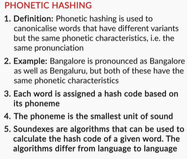

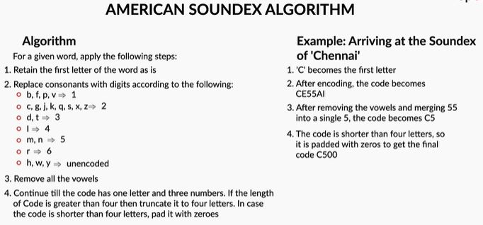

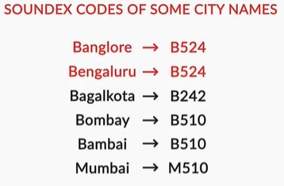

Phonetic hashing is done using the Soundex algorithm. American Soundex is the most popular Soundex algorithm. It buckets British and American spellings of a word to a common code. It doesn't matter which language the input word comes from - as long as the words sound similar, they will get the same hash code.

Now, let’s arrive at the Soundex of the word ‘Mississippi’. To calculate the hash code, you’ll make changes to the same word, in-place, as follows:

1. Phonetic hashing is a four-letter code. The first letter of the code is the first letter of the input word. Hence it is retained as is. The first character of the phonetic hash is ‘M’. Now, we need to make changes to the rest of the letters of the word.
2. Now, we need to map all the consonant letters (except the first letter). All the vowels are written as is and ‘H’s, ‘Y’s and ‘W’s remain unencoded (unencoded means they are removed from the word). After mapping the consonants, the code becomes MI22I22I11I.
3. The third step is to remove all the vowels. ‘I’ is the only vowel. After removing all the ‘I’s, we get the code M222211. Now, you would need to merge all the consecutive duplicate numbers into a single unique number. All the ‘2’s are merged into a single ‘2’. Similarly, all the ‘1’s are merged into a single ‘1’. The code that we get is M21.
4. The fourth step is to force the code to make it a four-letter code. You either need to pad it with zeroes in case it is less than four characters in length. Or you need to truncate it from the right side in case it is more than four characters in length. Since the code is less than four characters in length, you’ll pad it with one ‘0’ at the end. The final code is M210.

Since the process is fixed, we can simply create a function to create a Soundex code of any given input word. Learn how to make such function  with a Jupyter notebook. Download the Jupyter notebook from the link given below to follow along:

NOTE: Please follow the notebook provided below, there is a slight change int he function to make it perform correctly.

[Soundex Notebook](dataset/soundex.ipynb)

Up next, you’ll learn how to identify and measure the 'distance between words' using the concept of **edit distance** which will help you build your own spell corrector.

### Edit Distance
In the last section, you saw how to deal with different pronunciations of a particular word. Next, you’ll learn how to deal with misspellings. As already discussed, misspellings need to be corrected in order to stem or lemmatize efficiently. The problem of misspellings is so common these days, especially in text data from social media, that it makes working with text extremely difficult, if not dealt with.

Now, to handle misspellings, you’ll learn how to make a **spell corrector**. All the misspelt words will be corrected to the correct spelling. In other words, all the misspelt words will be canonicalised to the base form, which is the correct spelling of that word. But to really understand how a spell corrector works, you’ll need to understand the concept of **edit distance**.

An edit distance is a distance between two strings which is a non-negative integer number.

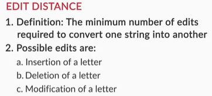

As you just learnt, an edit distance is the number of edits that are needed to convert a source string to a target string.
Now, the question that comes to the mind is - what’s an edit? An edit operation can be one of the following:
1. **Insertion** of a letter in the source string. To convert ‘color’ to ‘colour’, you need to insert the letter ‘u’ in the source string.
2. **Deletion** of a letter from the source string. To convert ‘Matt’ to ‘Mat’, you need to delete one of the ‘t’s from the source string.
3. **Substitution** of a letter in the source string. To convert ‘Iran’ to ‘Iraq’, you need to substitute ‘n’ with ‘q’

Now, it is easy to tell the edit distance between two relatively small strings. You can probably tell the number of edits that are needed in the string ‘applaud’ to ‘apple’. Did you guess how many? You need three edits. Substitution of ‘a’ to ‘e’ in a single edit. Then you require two deletions - deletion of the letters ‘u’ and ‘d’. Hence, you need a total of three edit operations in this case. But, this was a fairly simple example. It would become difficult when the two strings are relatively large and complex. Try calculating the edit distance between ‘deleterious’ and ‘deletion’. It’s not obvious in the first look. Hence, we need to learn how to calculate edit distance between any two given strings, however long and complex they might be.

More importantly, we need an algorithm to compute the edit distance between two words. 

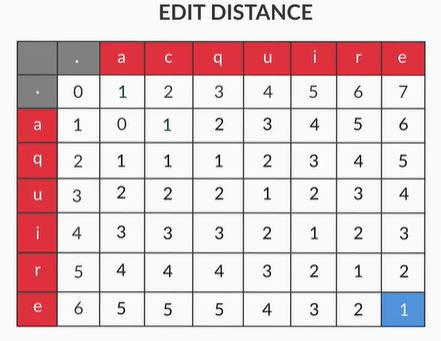

So, that’s how the Levenshtein edit distance is calculated.

Since the process of calculating edit distance is fixed, and now that you know it, you can write an algorithm to automate this computation. Let's see how to write the algorithm in the following lecture. Download the Jupyter notebook given below to follow along.

[Edit Distance notebook](dataset/edit+distance.ipynb)

So that’s how you compute the edit distance between two given strings. You also saw another variation of the edit distance - the Damerau–Levenshtein distance. The Damerau–Levenshtein distance, apart from allowing the three edit operations, also allows the swap (transposition) operation between two adjacent characters which costs only one edit instead of two.

This edit operation was introduced because swapping is a very common mistake. For example, while typing, people mistype ‘relief’ to ‘releif’. This has to be accounted as a single mistake (one edit distance), not two.

But how to make a spell corrector which was the main objective in the first place? You’ll learn to do that in the next section.

### Spell Corrector - I
A spell corrector is a widely used application that you would see almost everywhere on the internet. If you have the autocorrect feature enabled on your phone, the incorrect spellings get replaced by the correct ones. Another example is when you use a search engine such as Google to search anything and mistype a word, it suggests the correct word.

Spell correction is an important part of lexical processing. In many applications, spell correction forms an initial preprocessing layer. For example, if you are making a chatbot to book flights, and you get the user request 'Book a flight from Mumbai to Bangalor', you want to gracefully handle that spelling error and return relevant results.

Now, people have made various attempts to make spell correctors using different techniques. Some are very basic and elementary which use lexical processing, while others are state-of-the-art performers which use deep learning architectures.

Here, you’re going to learn the Norvig’s spell corrector which gives you really good performance and result, given its simplicity.

You can download the Jupyter notebook and the seed document 

[Spell Corrector Notebook](dataset/spell-corrector.ipynb)

[Seed Document](dataset/big.txt)

Now, let’s look at what each function does. The function words() is pretty straightforward. It tokenises any document that’s passed to it. You have already learnt how to tokenise words using NLTK library. You could also use regular expressions to tokenise words. The ‘Counter’ class, which you just saw in the Jupyter notebook, creates a frequency distribution of the words present in the seed document. Each word is stored along with its count in a Python dictionary format. You could also use the NLTK’s FreqDist() function to achieve the same results. It’s just that there are more than one way to do things in Python. And it’s always nice to know more than one way to perform the same task.

Now, the seed document ‘big.txt’ is nothing but a book. It’s the book ‘The Adventures of Sherlock Holmes’ present in text format at project Gutenberg’s website. A seed document acts like a lookup dictionary for a spell corrector since it contains the correct spellings of each word.

Now, you might ask why not just use a dictionary instead of a book? You’ll get to know why we’re using a book a little later. Now, in the next part, we will use edit distance in the spell corrector.

You just saw two functions. The edits_one() function and the edits_two() function. The edits_one() function creates all the possible words that are one edit distance away from the input word. Most of the words that this function creates are garbage, i.e. they are not valid English words. For example, if you pass the word ‘laern’ (misspelling of the word ‘learn’) to edits_one(), it will create a list where the word ‘lgern’ will be present since it is an edit away from the word ‘laern’. But it’s not an English word. Only a subset of the words will be actual English words.

Similarly, the edits_two() function creates a list of all the possible words that are two edits away from the input word. Most of these words will also be garbage.

The **known()** function filters out the valid English word from a list of given words. It uses the frequency distribution as a dictionary that was created using the seed document. If the words created using edits_one() and edits_two() are not in the dictionary, they’re discarded.

Now, the function **possible_corrections()** returns a list of all the potential words that can be the correct alternative spelling. For example, let’s say the user has typed the word ‘wut’ which is wrong. There are multiple words that could be the correct spelling of this word such as ‘cut’, ‘but’, ‘gut’, etc. This functions will return all these words for the given incorrect word ‘wut’. But, how does this function find all these word suggestions exactly? It works as follows:
1. It first checks if the word is correct or not, i.e. if the word typed by the user is a present in the dictionary or not. If the word is present, it returns no spelling suggestions since it is already a correct dictionary word.
2. If the user types a word which is not a dictionary word, then it creates a list of all the **known** words that are **one edit** distance away. If there are no valid words in the list created by edits_one() only then this function fetches a list of all known words that are **two edits** away from the input word
3. If there are no known words that are two edits away, then the function returns the  original input word. This means that there are no alternatives that the spell corrector could find. Hence, it simply returns the original word.

Finally, there is the **prob()** function. The function returns the probability of an input word. This is exactly why you need a seed document instead of a dictionary. A dictionary only contains a list of all correct English words. But, a seed document not only contains all the correct words but it could also be used to create a frequency distribution of all these words. This frequency will be taken into consideration when there are more than one possibly correct words for a given misspelled word. Let’s say the user has input the word ‘wut’. The correct alternative to this word could be one of these words - ‘cut’, ‘but’ and ‘gut’, etc. The possible_corrections() function will return all these words. But the prob() function will create a probability associated with each of these suggestions and return the one with highest probability. Suppose, if a word ‘but’ is present 2000 times out of a total of million words in the seed document, then it’s probability would be 2000/1000000, i.e. 0.002.

### Spell Corrector - II
In this section, you’ll continue to build the rest of the spell corrector. Till now, you’ve seen how to build the functions edits_one(), edits_two(), known(), possible_corrections() and prob(). Let’s understand all these functions in more depth by taking a look at their outputs.

Now, we’re almost done building the spell corrector. You just need to put all the pieces of the code together and wrap them up in a new function that uses all the functions created till now.

There you go! You have successfully created a pretty good spelling corrector. You can now use it to correct the spelling of any given text corpus such as the spam dataset where there were a lot of misspellings.

To use the spell corrector that you just finished building, you could import the spell corrector using the following command:

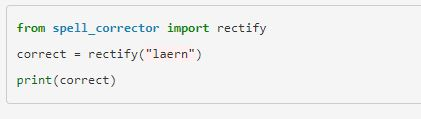

But make sure that you place the following file in your working directory to make sure that you don’t get an error while importing the function.

[Spell Corrector](dataset/spell_corrector.py)

In the next section, you’ll learn about a metric called the pointwise mutual information (PMI) which will help you tokenise terms that comprise of more than a word.

### Pointwise Mutual Information - I
Till now you have learnt about reducing words to their base form. But there is another common scenario that you’ll encounter while working with text. Suppose there is an article titled “Higher Technical Education in India” which talks about the state of Indian education system in engineering space. Let’s say, it contains names of various Indian colleges such as ‘International Institute of Information Technology, Bangalore’, ‘Indian Institute of Technology, Mumbai’, ‘National Institute of Technology, Kurukshetra’ and many other colleges. Now, when you tokenise this document, all these college names will be broken into individual words such as ‘Indian’, ‘Institute’, ‘International’, ‘National’, ‘Technology’ and so on. But you don’t want this. You want an entire college name to be represented by one token.

To solve this issue, you could either replace these college names by a single term. So, ‘International Institute of Information Technology, Bangalore’ could be replaced by ‘IIITB’. But this seems like a really manual process. To replace words in such manner, you would need to read the entire corpus and look for such terms.

Turns out that there is a metric called the **pointwise mutual information**, also called the **PMI**. You can calculate the PMI score of each of these terms. PMI score of terms such as ‘International Institute of Information Technology, Bangalore’ will be much higher than other terms. If the PMI score is more than a certain threshold then you can choose to replace these terms with a single term such as ‘International_Institute_of_Information_Technology_Bangalore’.

But what is PMI and how is it calculated?

You saw how to calculate PMI of a term that has two words. The PMI score for such term is:

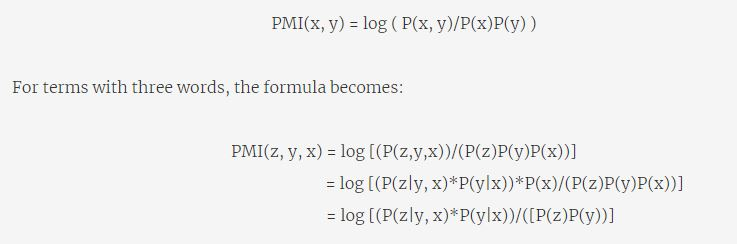

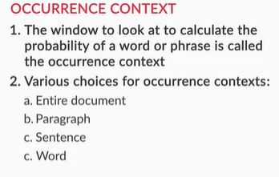

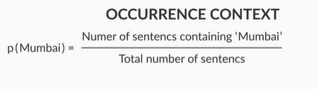

Till now, to calculate the probability of your word you chose words as the occurrence context. But you could also choose a sentence or even a paragraph as the occurrence context.

If we choose **words as the occurrence context**, then the probability of a word is:

P(w) = Number of times given word ‘w’ appears in the text corpus/ Total number of words in the corpus

Similarly, if a **sentence is the occurrence context**, then the probability of a word is given by:

P(w) = Number of sentences that contain ‘w’ / Total number of sentences in the corpus

Similarly, you could calculate the probability of a word with paragraphs as occurrence context.

Once you have the probabilities, you can simply plug in the values and have the PMI score.

### Pointwise Mutual Information - II
Now, calculating PMI score for a two-word term was pretty straightforward. But when you try to calculate the PMI of a three-word term such as “Indian Institute of Technology”, you will have to calculate P(Indian Institute Technology). To calculate such probability, you need to apply the chain rule of probability.

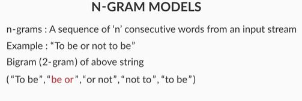

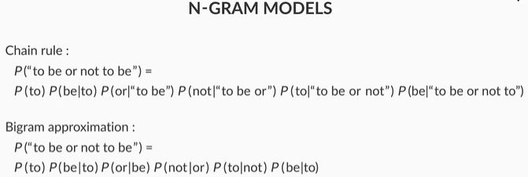

In practical settings, calculating PMI for terms whose length is more than two is still very costly for any relatively large corpus of text. You can either go for calculating it only for a two-word term or choose to skip it if you know that there are only a few occurrences of such terms.

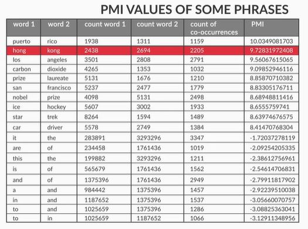

After calculating the PMI score, you can compare it with a cutoff value and see if PMI is larger or smaller than the cutoff value. A good cutoff value is zero. Terms with PMI larger than zero are valid terms, i.e. they don’t need to be tokenised into different words. You can replace these terms with a single-word term that has an underscore present between different words of the term. For example, the term ‘New Delhi’ has a PMI greater than zero. It can be replaced with ‘New_Delhi’. This way, it won’t be tokenised while using the NLTK tokeniser.

 